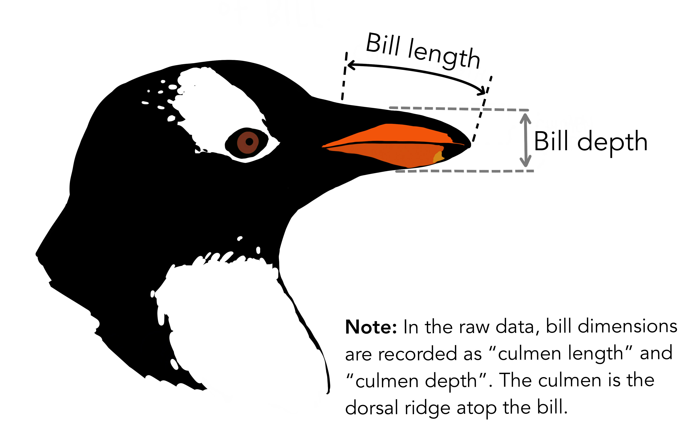

## The Return of the Penguins

Once again, we will look at data about three species of penguins that live in the Palmer Archipelago, a set of Antarctic islands south of South America.

This time, we'll start by looking at the first six rows of the data, which will let us see all the variables. We do this using the `head()` function.

```{code-blanks-instructions}
Press the “Run code” button below to see the first six rows of the dataset
```

```{code-blanks}
#| blank:
#|   target: penguins
#|   prefill: true
#|   occurrence: 1
#|   match: token

head(penguins)

```

```{code-blanks-response}
Which variables in the dataset are numerical?
```

To clarify what a couple of those variables mean, here's a helpful diagram:

{fig-alt="Annotated diagram of a penguin's head and bill. Bill depth is shown as the height of a penguin's bill/beak. Bill length is the length from the tip of the bill to where it merges with the rest of the penguin's head. Note: in the raw data, bill dimensions are recorded as \"culmen length\" and \"culmen depth.\" The culmen is the dorsal ridge atop the bill." width="299"}

## Summarizing Numerical Variables

Suppose we want to know the mean and median bill lengths for all the penguins as well as the number of penguins in the dataset. The code below uses `summarize()` to make a table that does this. Run the code to see the table.

```{code-blanks}
#| blank:
#|   target: mean
#|   prefill: true
#|   occurrence: 1
#|   match: token
#| blank:
#|   target: median
#|   prefill: true
#|   occurrence: 1
#|   match: token
#| blank:
#|   target: n()
#|   prefill: true
#|   occurrence: 1
#|   match: token

summarize(penguins,
          "Mean Bill Length" = mean(bill_length_mm, na.rm = TRUE),
          "Median Bill Length" = median(bill_length_mm, na.rm = TRUE),
          "Number of Penguins" = n()
          )

```

The descriptions inside the quotes are the column names and are up to us. In the functions for finding mean and median, `na.rm = TRUE` removes any penguins for which this values is missing. 

**Debugging tip:** When there's a missing value, `mean()` and `median()` return `NA` inseady of a number.

Fill in the blanks below to make a table showing mean bill length, mean bill depth, and median body mass.

```{code-blanks}
#| blank:
#|   target: mean
#|   prefill: false
#|   occurrence: 2
#|   match: token
#| blank:
#|   target: bill_depth_mm
#|   prefill: false
#|   occurrence: 1
#|   match: token
#| blank:
#|   target: median
#|   prefill: false
#|   occurrence: 1
#|   match: token

summarize(penguins,
          "Mean Bill Length" = mean(bill_length_mm, na.rm = TRUE),
          "Mean Bill Depth" = mean(bill_depth_mm, na.rm = TRUE),
          "Median Body Mass" = median(body_mass_g, na.rm = TRUE)
          )

```

Finally, sometimes we want to compare numerical statistics across categories. For example, here's the bill length table split by sex:

```{code-blanks}
#| blank:
#|   target: group_by
#|   prefill: true
#|   occurrence: 1
#|   match: token
#| blank:
#|   target: sex
#|   prefill: true
#|   occurrence: 1
#|   match: token

summarize(group_by(penguins, sex),
          "Mean Bill Length" = mean(bill_length_mm, na.rm = TRUE),
          "Median Bill Length" = median(bill_length_mm, na.rm = TRUE),
          "Number of Penguins" = n()
          )

```

```{code-blanks-response}
What function in the code categorizes the penguins by sex?
```

```{code-blanks-response}
How do the bill lengths of male and female penguins seem to differ?
```

Fill in and run the code below to make a table showing the mean body mass and number of penguins in the dataset by species.

```{code-blanks}
#| blank:
#|  target: body_mass_g
#|  prefill: false
#|  occurrence: 1
#|  match: text
#| blank:
#|  target: group_by
#|  prefill: false
#|  occurrence: 1
#|  match: text
#| blank:
#|  target: species
#|  prefill: false
#|  occurrence: 1
#|  match: text

summarize(group_by(penguins, species),
          "Mean Body Mass" = mean(body_mass_g, na.rm = TRUE),
          "Number of Penguins" = n()
          )
```

```{code-blanks-response}
In 1-2 sentences, describe the key takeaways from the results in the table above.
```

## Graphing Numerical Variables

Histograms are the most common graph for visualizing numerical data. The code for a histogram looks a lot like the code for a bar graph, but with a different **geom**.

```{code-blanks}
#| blank:
#|   target: geom_histogram()
#|   prefill: true
#|   occurrence: 1
#|   match: token

ggplot(penguins) +
  aes(x = bill_length_mm) +
  geom_histogram() +
  labs(
    title = "Palmer Archipelago Penguins' Bill Lengths",
    x = "Bill Length (mm)",
    y = "Number of Penguins"
  )

```

Based on this, make a histogram showing penguin's body masses by filling in the code below.

```{code-blanks}
#| blank:
#|   target: geom_histogram()
#|   prefill: false
#|   occurrence: 1
#|   match: token
#| blank:
#|   target: body_mass_g
#|   prefill: false
#|   occurrence: 1
#|   match: token
#| blank:
#|   target: blank1
#|   prefill: false
#|   occurrence: 1
#|   match: token

ggplot(penguins) +
  aes(x = body_mass_g) +
  geom_histogram() +
  labs(
    title = "Palmer Archipelago Penguins' Body Masses",
    x = "blank1",
    y = "Number of Penguins"
  )

```

```{code-blanks-response}
Describe the shape of the body mass histogram.
```

Sometimes we want wider or narrower bins. Experiment with the value of `binwidth` below to change this.

```{code-blanks}
#| blank:
#|   target: 1
#|   prefill: true
#|   occurrence: 1
#|   match: token

ggplot(penguins) +
  aes(x = bill_length_mm) +
  geom_histogram(binwidth = 1) +
  labs(
    title = "Palmer Archipelago Penguins' Bill Lengths",
    x = "Bill Length (mm)",
    y = "Number of Penguins"
  )

```

```{code-blanks-response}
What binwidth seems best to you for this data?
```

Like in the tables, we may want to compare multiple categories. There are two main ways of doing this. Here's the first:

```{code-blanks}
#| blank:
#|   target: species
#|   prefill: true
#|   occurrence: 1
#|   match: token
#| blank:
#|   target: 0.7
#|   prefill: true
#|   occurrence: 1
#|   match: token

ggplot(penguins) +
  aes(x = bill_length_mm, fill = species) +
  geom_histogram(position = "identity", alpha = 0.7) +
  labs(
    title = "Palmer Archipelago Penguins' Bill Lengths",
    x = "Bill Length (mm)",
    y = "Number of Penguins",
    fill = "Species"
  )

```

The `position = "identity"` portion means that the histograms are overlapping, not stacked (which would make the heights of bars for individual species hard to judge) or dodged (which makes the horizontal axis difficult to use).

Experiment with the value of `alpha` in the code above. It can be any number between 0 and 1.

```{code-blanks-response}
What does `alpha` seem to do?
```

Make a histogram of body mass split by island by filling in the blanks below.

```{code-blanks}
#| blank:
#|   target: fill = island
#|   prefill: false
#|   occurrence: 1
#|   match: token
#| blank:
#|   target: identity
#|   prefill: false
#|   occurrence: 1
#|   match: token

ggplot(penguins) +
  aes(x = body_mass_g, fill = island) +
  geom_histogram(position = "identity", alpha = 0.7) +
  labs(
    title = "Palmer Archipelago Penguins",
    x = "Body Mass (g)",
    y = "Number of Penguins",
    fill = "Island"
  )

```

```{code-blanks-response}
Describe the similarities and differences in body mass by species.
```

The second way to compare different categories is with subgraphs, which are called **facets** in R. Here's an example:

```{code-blanks}
#| blank:
#|   target: facet_wrap
#|   prefill: true
#|   occurrence: 1
#|   match: token
#| blank:
#|   target: species
#|   prefill: true
#|   occurrence: 1
#|   match: token

ggplot(penguins) +
  aes(x = bill_length_mm) +
  geom_histogram() +
  facet_wrap(~ species) + 
  labs(
    title = "Palmer Archipelago Penguins' Bill Lengths",
    x = "Bill Length (mm)",
    y = "Number of Penguins"
  )

```

```{code-blanks-response}
When do you think overlapping histograms would be clearer, and when do you think facets would be clearer?
```

Make a histogram of your choosing that uses one numerical variable and has facets for one categorical variable.

```{code-blanks}
#| blank:
#|  target: "blank1"
#|  prefill: false
#|  occurrence: 1
#|  match: text

#| blank:
#|  target: "blank2"
#|  prefill: false
#|  occurrence: 1
#|  match: text

#| blank:
#|  target: "blank3"
#|  prefill: false
#|  occurrence: 1
#|  match: text

#| blank:
#|  target: "blank4"
#|  prefill: false
#|  occurrence: 1
#|  match: text

#| blank:
#|  target: "blank5"
#|  prefill: false
#|  occurrence: 1
#|  match: text

ggplot(penguins) +
  aes("blank1") +
  geom_histogram(binwidth = "blank5") +
  facet_wrap(~ "blank2") +
  labs(
    title = "Palmer Archipelago Penguins",
    x = "blank3",
    y = "blank4"
  )

```

```{code-blanks-response}
What key conclusions should someone draw from your graph?
```

Congratulations! You can now make summary statistics tables and histograms in R.
