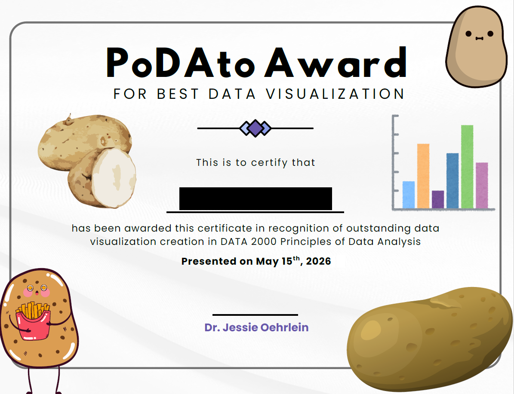

This semester was the third time that Principles of Data Analysis (PoDA) had run. I had been happy with a lot about how the past two years went, so the in-class experience largely stayed the same. But I made some adjustments to out-of-class work, and there were some aspects that I thought needed attention after last spring.

## Did I Make Progress?

Last spring I said that I particularly wanted to work on how I teach clustering, the role of homework vs case studies, better support for and practice in R, and more focus on ethics, documentation, and student writing.

Parts of some of this happened, but mostly not to the extent I wanted.

-   **Clustering:** I planned out some better intro activities for this. Only part of it really got done in time, but that part worked pretty well! So I think I have a reasonable path here. But I need to work on incorporating some of the (not super common...) examples where clustering is actually meaningful.

-   **HW vs Case Studies:** I didn't have case studies as an assignment this year. I kept a couple of them around as in-class work; I'd been launching them in class anyway, so this was a pretty minor adjustment. The data visualization case study I broke up into smaller pieces and spread across multiple homework assignments. That said, the nature and goals of the homework assignments are still aspects I don't have nailed down.

-   **Better support for and practice in R:** Overall, I think I really fell down on this part this semester. I got some better structure within particular activities, but I think I need to be doing some much more explicit differentiation. It is in the nature of this class that there will be a really wide range of student backgrounds in and feelings about programming in general and R in particular. I think there are points in the semester where I could make more headway with giving students some individual choice in amounts of support. But also, like I said when I wrote a PoDA reflection post last summer, there are also a lot of ways I could be better using intro programming approaches (pair programming, "here's the marker; add the next line on the board," Parsons problems, clicker questions, tracing). I should just actually plan it.

-   **More ethics, documentation, and writing:** I added a type of assignment this year called Data Experience Journals that definitely brought in more ethics discussion! I added in a couple more small activities on documentation that helped, but there were also spots where the journals helped with that, too. Especially with the removal of the case studies, I don't think I made any progress on focusing on student writing, though the journals (again!) had us talking about writing more.

## Data Experience Journals

When I talk to people outside of Fitchburg State, I describe PoDA as an intro data science course, which I think it is. But its positionality is a little funky because the computer science department has a 3000-level Intro to Data Science that, at a level of listing topics, doesn't look all that different, though it has PoDA as a possible prereq. (And folks in the CS department saw the PoDA syllabus before the course went through governance.) I've had students tell me they don't feel too repetitive, but I still wanted to widen that gap.

One of the places where I thought I could do that was in providing a wide view of what quantitative data analysis looks like. For each of five Data Experience Journals through the semester, I gave students some options of things to read, listen to, or otherwise engage with. They answered some reflection questions about them, and then we talked about them in class. It's really just a reading & discussion assignment, but it was a useful path into talking about nearly every aspect of the class: effective data visualization, ways to represent and talk about data, data access, what data cleaning and wrangling can look like and why they matter, the ethics of modeling. Even in quite a small class, even on days when not everyone had completed the assignment yet, the discussions were valuable.

Through the discussions we'd had around data physicalization at the beginning of the semester based on the first journal, I explicitly opened the door to the final project being or including a wider variety of representations of data. The prompt had always been "Pick a dataset and do something with it," but a lot of my guidance was written with an artifact that looked like a paper/report in mind. This semester, I had two students make textile data visualizations as part of the final projects. One was a temperature blanket that also documented a family move, and one was a cross stitch piece of bigfoot sightings. I don't think that will happen every time I offer PoDA, but this feels like a success in finding what the course can be.

## Overall

After three times teaching the course, I think the biggest places where PoDA can be fundamentally different from the CS department's Intro to Data Science are:

-   A recurring focus on the titular [design principles (McGowan et al)](https://www.tandfonline.com/doi/full/10.1080/10618600.2022.2104290) -- Spring 2025 was when I did the best job of this;

-   Providing a broad view of work with and about data -- Huge progress on that this semester;

-   Being a friendly entryway for students with no programming experience while also being engaging for students who have a lot -- This is where I need to put the work in.

I think the more confident I feel about that last part, the better I'll feel about recruiting a wide range of students for the course, which is really needed.

After this coming spring, we're going to put PoDA on an every-three-semester rotation, along with a number of other courses in the Math Department. We'll see how that goes in terms of recruitment, getting students in and through the Data Analytics major, etc., but hopefully it results in slightly larger class size when the course runs.

Finally, some silliness that I started this semester and love: my partner had noted that PoDA sounds a lot like the beginning of "potato." So I decorated a certificate with icons of graphs and potatoes, asked students to choose one graph from their visualization project, and asked other folks on campus to vote for the best visualization. I gave the first PoDAto Award for Best Data Visualization out at the end of finals period, and I'm excited to keep doing little culture things like that with the Data students.

{fig-alt="PoDAto Award for Best Data Visualization certificate decorated with images of potatoes and bar graphs. The certificate reads \"This is to certify that NAME has been awarded this certificate in recognition of outstanding data visualization creation in DATA 2000 Principles of Data Analysis.\" Student name is blacked out." width="443"}
