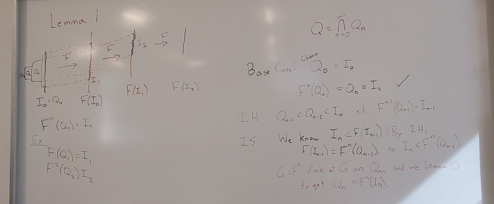

This semester I taught what is likely the final offering of our one-credit Math Seminar course, which is being phased out after a curriculum change. The first time I taught the course, in my second year at Fitchburg State, I focused on time series analysis -- interesting, could be made appropriately scoped, fit the "stats person" role I was still learning to fill. This time, I realized that this might be my best chance, at least for a while, to teach atmospheric science-related things at the college level. So I chose [Math of Climate](https://jessoehrlein.github.io/Sp26-Math3900/) as the focus.

All of the students in the class were juniors and seniors. They were coming from a pretty mixed set of class experiences, though. A couple had taken ODEs, a few were in Methods of Applied Math (advanced linear algebra + some transforms + some PDEs), and a few were in Numerical Analysis. Those all had some overlap with where this class went, but focused in different ways.

## Topics

My initial plan was that the first half of the semester would be dynamical systems, the next quarter-ish would be time series analysis, extreme value theory, and attribution theory, and then we'd close with student projects.

We ended up doing more dynamical systems than that, with fewer explicit climate tie-ins than I expected, more climate inspiration. I had planned to do some ocean box models in class, for example, but we extended the discussion of 1D continuous systems, bifurcations, and hysteresis in class instead, and I think that was useful. In general, we ended up spending more time in class discussing the homework than I had planned at first, but once I realized that was the right flow for this group, it worked well.

The place where the dynamical systems section really stretched, though, was in reading Li and Yorke's "Period Three Implies Chaos." We spent an additional class period beyond my plan working through the central proof. But I didn't want to rush it. More on that below.

Spending longer on the paper compressed the other topics a bit. We really spent one day (not always even full class periods) on getting flavors of time series analysis, extreme value theory, and attribution theory. But doing those topics more lightly turned those class periods into more of conversations, where student questions shaped the direction we went. For example, the time series day started with discussion of homework that had walked the students through empirical orthogonal functions/principal component analysis (with a quick student-led review of eigenstuff when we figured out that some folks hadn't made it there in their Linear classes), which then carried over into a class discussion of EOF-based vs station-based approaches to calculating North Atlantic Oscillation indices. After that, I pulled up an MJO phase chart as an example of being interested in multiple principal components. I expected to show that for a couple of minutes and then move on, but the students asked a lot of questions! It meant we only spent a little bit of time looking at autocorrelation diagrams and measures (and looked at no power spectra), but it felt more meaningful and enjoyable to dwell in the example of the ideas they'd worked through and really figure out what was going on there.

## Paper Reading

Going through "Period Three Implies Chaos" is the part of the course that I'm most proud of. Math papers are terse and frustrating, and it's entirely possible to go through an undergrad math degree and never really read one. (Some upper-level textbooks get close, but I don't really think they should.) So it felt important to scaffold this experience of reading a paper that is undergrad-appropriate but old and *quite* succinct.

We went through the background and setup of the paper together in class, and then I sent them off with a reading guide to work through the statement of the main theorem, the proof that there is a periodic point of period $k$ for every positive integer $k$ if there is a periodic point of period 3, and the proof that a point of period 5 does not imply the existence of a point of period 3. A couple of those reading guides came back complete and largely following the proofs, but most of them came back with valiant attempts and lots of question marks. Which was exactly the point! So then we took our time over a couple of class periods unpacking claims and proofs, drawing lots of pictures, and putting everything back together. (With a good bit of complaining about mathematical writing norms along the way.)

{fig-alt="Whiteboard work from unpacking \"Period Three Implies Chaos\" Lemma 1, featuring maps among intervals with some nested intervals and an expansion of the paper's proof."}

When I was planning the course in January, I had planned to do something like this with one or two more papers over the course of the semester, maybe Manabe & Strickler '64 and maybe one of the early attribution papers. It became clear pretty quickly that there wasn't going to be time or energy for more than one. Li & Yorke was the mathiest choice.

## Projects

This course traditionally has some kind of final project. For Math of Climate, I wrote the project assignment so that the default was expository: learn about something we haven't covered or go deeper/in a different direction on something we have and then share what you learned. I left some room for analysis-y projects, either analyzing some climate data or using a method we had discussed in class on different data, but no one chose that direction.

I was a little worried about how projects for this course would go. It's a one-credit class, and a lot of the students had other multiple other courses with "heavier" final projects. I knew this one wouldn't be the highest priority, and I could see the students putting it off a little bit based on conversations about progress when I checked in with them in class. But things went all right! The students chose diverse and interesting topics, often in ways that touched on current research. Their chosen topics included topological data analysis of weather regimes, uncertainty in numerical weather prediction, Milankovitch cycles, the Atlantic Meridional Overturning Circulation, sea level rise, Stokes waves, and agent-based models for coral growth.

The aspect of the projects that didn't quite work out was that I had asked for something interactive in their presentation (trying problems, going through some kind of demo, discussing graphs or questions), for them to be more of a teaching activity in a way. This wasn't a totally unreasonable ask for this particular group of students, but it was too much to add on to this scope of project for this course.

## Overall

Both times I've taught Math Seminar, I haven't felt like I've really done it justice. It's only one credit, not trying to meet a particular curricular need, and usually at the end of the week, so it's easy for prep to end up as a morning-of problem. Even when I want to put more time in, a one-credit class just doesn't have that much time budgeted to it compared to everything else.

But overall, it went all right, and it was really fun to get to work with upper-level students on topics that I enjoy outside of statistics, all the areas like atmospheric science and dynamical systems that got me here in the first place. I didn't expect how much I would *love* the project presentations, getting to hear these students speaking bits of a language that I spent five years immersed in, getting to talk to them in that language about something they were exploring at least somewhat by choice. I'm not really in atmospheric or climate science anymore, but I do get a little homesick for it. And I love sharing it.
