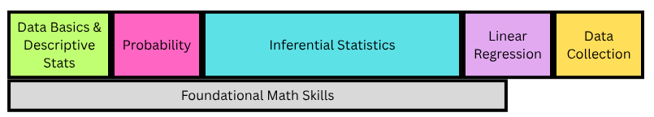
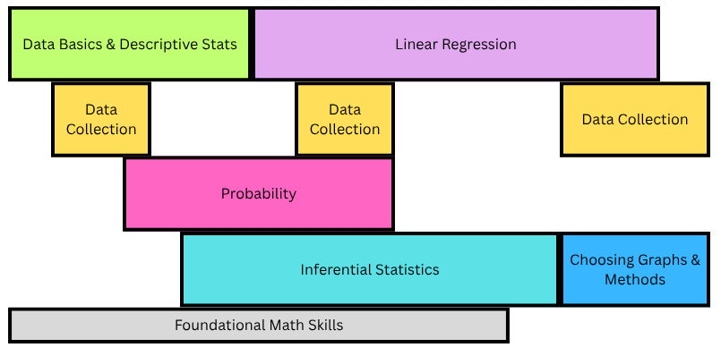

This spring, I again taught two different flavors of introductory statistics: Applied Statistics (no mathematical prereq, mostly social sciences and health sciences students) and Statistical Analysis (college algebra/precalc prereq, mostly CS and CIS students). Below are some thoughts on how this semester went and what I'm considering for future semesters.

## Applied Statistics

### Class Structure

This was my 10th consecutive semester teaching Applied Stats. A lot of this looked like the structure I'd been using for the previous couple of semesters:

-   A Do Now/entry ticket to start class, followed by some team activities (often in a POGIL style) for most of class time, and then an exit ticket at the end of class;

-   A bundle of out-of-class assessments consisting of online homework graded on completion for practice, weekly surveys graded on completion for reflection & communication with me about how things were going, regular Written Assignments focused on doing or interpreting data analyses, and standards-based quizzes.

But that first bullet point obscures a substantial change that I made to the structure of the semester and class periods. Previously, the sequence of material looked something like this:

{fig-alt="A sequence of topics starting with Data Basics & Descriptive Stats, then Probability, then Inferential Stats, then Linear Regression, then Data Collection, with Foundational Math Skills below through most of the semester." width="404"}

I incorporated some spaced practice on homework and Do Nows, but class proceeded pretty linearly through topics. Class time between Do Nows and exit tickets was usually all new concepts, with a few scattered days dedicated to review and practice.

Over the past few semesters, I had started to feel like some topics were building too quickly for many students. The big example of this was hypothesis testing. It didn't feel like students had time to practice each of the individual components of hypothesis testing before they needed to build on it with the next one. They were still acquiring the skill of identifying or writing hypotheses when we started using hypotheses to talk about what p-values meant (even if I had tried to foreshadow that with lots of playing around with sampling distributions previously!). They were nowhere near successfully interpreting a p-value when we started using them as part of coming to a conclusion or evaluating evidence. A little bit of a spiral structure in the inference unit helped, but it wasn't enough to prevent some students from feeling lost for an entire topic.

I needed a structure that would give students more time to practice those ideas before they had to build on them. So I tried this:

{fig-alt="Layers of topics. Data Basics & Descriptive Stats lasts about twice as long as it did. Small chunks of Data Collection occur at the beginning, middle, and end of the semester. Probability stretches from a couple of weeks in to about 2/3 of the way through the semester. Inferential Stats starts about a week later and stretches through about 80% of the semester. Linear Regression starts before mid-semester and stretches almost to the end. Choosing Graphs & Methods is at the very end. Foundational Math doesn't last as long as it did in the old version." width="404"}

Almost everything is stretched over more time, and there are always multiple "strands" happening in parallel. What this meant for individual class periods was that class didn't look like a single POGIL-style activity anymore. I chopped up my POGIL activities into their constituent models/learning cycles, and most class periods consisted of activities on a couple different topics. There was also almost always some kind of review or practice activity beyond just the Do Now.

After reading student reflections, thinking about my own experience of this shift, and seeing how students did, here's a summary of how this went:

-   Students did not universally notice that we were touching on multiple distinct topics in single class periods, but a lot of them did notice. Only a couple of them brought it up to me before I asked about it directly on the final reflection, though.

-   Students liked circling back to topics for more practice. Like the assessment system, it made it okay to not get something the first time. A few students talked about it in their reflections as repetitive in a good way. That said, I think I need to be more strategic about the timing and nature of that practice, both in class and when there's some spaced practice on homework, to get the most out of this aspect.

-   The pace and transitions between topics in class were sometimes rough. The fact that we were moving on to an activity about something different made it more important for students or teams to "keep up" with the timing on each individual activity, and we'd sometimes move on before lots of students felt solid with an idea. (I think that was true before, but it was probably more obvious here.) The shifts between topics could also be abrupt.

-   I was worried that this structure would make ideas feel less cohesive. I still think that might have happened overall, but a few students talked about feeling like they could really see the flow from previous ideas we practiced to the new ideas. Something I hadn't thought about that a student brought up was that topics coming back for review meant they didn't disappear and feel like just a one-off in the course.

-   How students did on quiz skills is not a very conclusive indicator here. Of the 12 skills that were common across the two semesters, a higher percentage passed 4 of the last semester, a higher percentage passed 5 of them this semester (though one of those had a change that likely contributed), and the other 3 were quite similar in passing percentages. Those differences are pretty much equivalent to the differences between Spring 2025 and Fall 2025, when I changed very little.

-   However, I added two new skills this semester related to data collection, now that it wasn't smushed in the last couple of weeks of the semester. Both of those new skills had passing rates above two-thirds! Being able to add those in effectively feels like a win.

I will try this again next spring when I teach Business Stats (same content, different population). I'm going to work more on planning out the pace and the practice. I'm also going to try to reincorporate some routines that I dropped while trying this experiment this semester: a weekly graph discussion and some regular learning inventory/brain dump-style activities.

### Other Aspects I'm Still Working On

I tried increasing the frequency of Written Assignments this semester, making each individual assignment smaller. I don't think this was the right move. Instead of getting everyone into a more regular rhythm, things just piled up more for both students and me. I'll be going back to something more like what I was doing before, though I'm going to try to refresh the assignments a bit.

Last spring and fall, I had tried having students keep and submit a vocab document through the semester. I tried a couple of different methods for this, and it didn't work well either time. This semester I tried updating a collective document myself based on what the students came up with in their teams in class. I was not able to sustain this well, and it ended up feeling like me doing work I want the students to be doing. So I'm still working on how to make this an effective resource for students.

### Taking a Break

I'm not teaching Applied Stats in the fall! It will be my first semester at Fitchburg State without teaching this course. It's a little weird right now to tell myself to stop thinking about it, but I think it will be good to have some distance.

When I come back to the course in the spring, it will technically be Business Stats instead of Applied Stats. Like I said above, this is the same course content with a different student population. I think that chance to work with students coming to statistics from a different direction will be an interesting reset, as well.

## Stat Analysis

### Daily Class

I kept a pretty similar in-class structure to the past, with a Do Now to start class, a POGIL-style or other team activity for most of class time, and an Exit Ticket at the end. I didn't do a good job of setting expectations early of what working in teams should look like, so there was a lot of individual work here that made pacing rough. But overall, this felt pretty good.

### Use of R

I feel pretty good about how I'm introducing new things in R through activities now. The aspect I'm still working on is scaffolding from there. Right now, there's a big jump between the level of structure that I'm providing on in-class activities and R Exercises (homework in the first half of the semester) and what I ask of students in terms of figuring out what they need code-wise on the Projects and some of the Case Studies.

So I need to make sure I'm including more practice opportunities with a level of support between "filling in some key blanks" and "write your code from scratch." Some of that needs to happen in class. I'd also like to do a better job of modeling resource and documentation use for things like this.

### Homework/Surveys

I kept the structure of a weekly check-in survey from last semester. Students engaged with some kind of extra resource and told me about it, and they also did two textbook problems (with a little bit of choice). Sometimes there was a creative/connection kind of question, and sometimes I nudged it more into a prep assignment if there was something I needed students to look at before class. I think the [Practice Problem Reflections that Peter Keep wrote about](https://www.peter-keep.com/2026-04-17-iterations-of-homework-policies/) would be a good fit here, so I'll try to move in that direction. I'm not sure how to combine that with the occasional need for it to double as class prep, but that's figure-out-able.

### Project

Last semester, I had students do one project with a bunch of parts, some focused on regression and some on inference. This semester, I separated it into two projects based on a single dataset. That kept the load of finding and choosing data low for students, but it allowed them a little more flexibility in progressing through the projects if they fell a bit behind. It was also easier to ask them to present one of their projects at the end of the semester than it was to be clear about what I meant by presenting one part of their project last semester.

The other helpful change was compressing the projects to about half the semester instead of spreading them over the full semester. That resulted in more consistent engagement with the project, so I could have better conversations with students about their projects.

### Case Studies & Interpretation Quizzes

I'm still struggling a bit with assessment in this course. Last fall, I felt like I was missing a "middle" space between routine R and stats practice and the projects, so this semester I tried adding back in an adjusted version of some assessments I'd used previously. Students did three case studies in class, focused on doing a statistical analysis on a provided dataset, and then a week later they took an in-class test that focused on interpreting some different analyses that used the same dataset.

The idea of sticking with the same dataset was removing the context fatigue of jumping among different data and situations. It also provided an opportunity for students to be familiar with the data and some of the factors that might be affecting it, so there wasn't as much unevenness in students' experience with contexts. This aspect didn't go perfectly, but it was an improvement on my older versions of these quizzes, and students seemed to appreciate the coherence.

But I ran into a few problems:

-   Case Studies took *much* longer than I initially expected. A large part of this is related to the gap in R support that I mentioned above, which feels solvable. There's a similar leap in some of the concepts, too, though. We hadn't done enough work before the case studies in aspects like choosing graphs, comparing models, choosing methods, etc. I'm really glad that this gap was highlighted because I think those are really important aspects to include in the course, and part of my fall planning is incorporating them better. Finally, the bumpiness of teaming slowed these down, as well.

-   I think I'm fighting with what I'm trying to measure and how on Interpretation Quizzes. These are useful kinds of questions to ask students, and I do want to know what they can come up with from their own brains on them. Seeing students' work always told me a lot about where they were at, and some of the students mentioned in reflections that studying for the quizzes and reading my feedback afterwards was helpful. But the actual grading step never felt like what I actually wanted to be doing, even if the three big categories that served as my grades usually felt correct. It's feeling more and more like I actually want this to be an oral exam; I want to have a conversation with students about these things. I just need to figure out if/how to make that work here.

So this will probably look pretty different in the fall, but I haven't figured out quite how yet.

## Overall

Across both of these courses, I feel like I've been learning what the skills students need practice with are, and the main thing I'm trying to work on is how to provide appropriate practice over time with those skills.

That feels like something both really big and kind of basic. But looking over the past five years (as I will have to do in putting together my tenure portfolio for the fall 😱), I think it's actually a lot of progress for that to be what I'm working on. I know overall how I want to teach these courses, and I feel good about how I introduce topics. It's a really solid base to build on.
